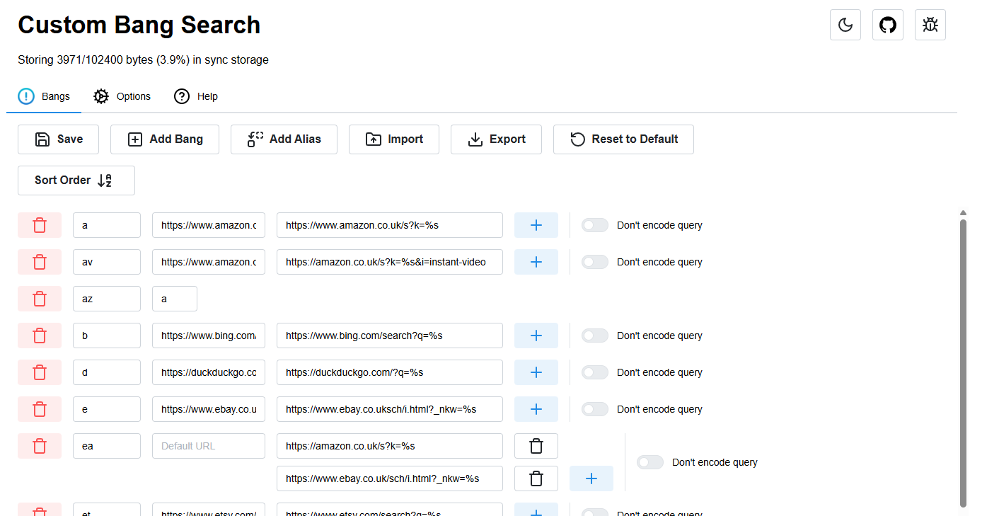
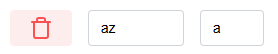

#  Custom Bang Search

[](https://addons.mozilla.org/en-US/firefox/addon/custombangsearch/)
[](https://addons.mozilla.org/en-US/firefox/addon/custombangsearch/)
[](https://addons.mozilla.org/en-US/firefox/addon/custombangsearch/)
[](https://chrome.google.com/webstore/detail/custom-bang-search/oobpkmpnffeacpnfbbepbdlhbfdejhpg?hl=en)
[](https://chrome.google.com/webstore/detail/custom-bang-search/oobpkmpnffeacpnfbbepbdlhbfdejhpg?hl=en)
[](https://chrome.google.com/webstore/detail/custom-bang-search/oobpkmpnffeacpnfbbepbdlhbfdejhpg?hl=en)

<a href="https://addons.mozilla.org/en-US/firefox/addon/custombangsearch/">

</a>

<a href="https://chrome.google.com/webstore/detail/custom-bang-search/oobpkmpnffeacpnfbbepbdlhbfdejhpg?hl=en">

</a>

A browser extension that lets you use custom DuckDuckGo-style bangs directly from the address bar

```
!a camera   ▶ https://www.amazon.co.uk/s?k=camera
!r G273QF   ▶ https://www.google.com/search?q=site%3Areddit.com+G273QF
!m new york ▶ https://www.google.com/maps/search/new%20york
!y boids    ▶ https://www.youtube.com/results?search_query=boids
```

## Demo Video

[](https://www.youtube.com/watch?v=IXP7RVFMJk4)

## Search Engines

In order for this extension to work, it has to intercept requests made to your search engine, and check if you are trying to use a bang. For this to work, the extension has to have permissions for that host, and has to have code to support it.

You can see the supported search engines [here](./docs/supported-engines.md).

If you set one of these as your browsers search engine, you can use the bangs directly in the search bar.

Bangs will also work by just using the search engines normally.

## Configuration

You can edit your bangs and general options using the extensions options page:



### Bangs

On the bang configuration page, you can configure each individual bang:


In this extension, bang refers to the entire row.

From left to right, the configuration row allows you to:

- Delete a bang
- Edit the bangs keyword
- Edit the bangs default URL. This is the location the bang will take you to if you dont provide a query
- Edit the list of URLs that the bang redirects to. This can be a single URL or a list, which will open multiple tabs. Each URL should contain %s, this will be replaced by your search query when the bang is used
- Add to / delete from the list of URLs
- Turn query encoding off / on. This decides if Custom Bang Search runs encodeURIComponent on your query before it creates the redirect URL. If you don't know what this means, you probably want to leave it off

**Aliases** are also supported, these are used to assign a keyword to behave exactly the same as an already existing bang:



The first input (left) is the keyword, and the second (right) is the bang to copy

### Options

The options tab allows you to change the behaviour of the extension, including the trigger (traditionally `!`), the config storage method, and other things.

#### Storage

If you select sync storage, all of your bangs and options are saved to the browsers sync storage, meaning if you log into your browser they will sync across to wherever else you are logged in. You can also select local, and they won't sync anywhere.

Sync storage has a strict quota, and you can see the amount of it you are using at the top of the options page.

### DuckDuckGo Bangs

There are some JSON files [here](./ddg/README.md) that contain the most popular DuckDuckGo bangs, if you want to import them

## How the extension works

CBS uses the `webRequest.onBeforeRequest` event listener to listen for requests to the supported search engines, and if a bang is found, sends the user to the chosen URL with the query inserted, using the `tabs.update` API.

## Development

### Building

```bash
git clone https://github.com/psidex/CustomBangSearch.git
cd CustomBangSearch
npm install
npm run build-firefox OR build-firefox-release OR build-chrome OR build-chrome-release
```

This produces a `build` directory containing the compiled JavaScript, and if building the release version, 2 zip files in the root of the project that can be uploaded to the browser web extension stores.

Non "release" builds (i.e. dev builds) are not minified, do more logging, force the browser to open the configuration page when the browser is opened, and also contains some development tools loaded into the popup window.

### Details

A custom script, `bob.mjs`, is used to build and package the extension. This was created just to speed up the build process and make testing much easier.

esbuild is used to compile the TypeScript to JavaScript, the tsc compiler is listed as a dependency but this is just used for type checking / linting.

The manifest files link to the compiled build made by esbuild, not the TS files, so make sure they are built before you build the extension package.

## Credits

- Icon created by [apien on Flaticon](https://www.flaticon.com/free-icon/exclamation-mark_4194667)
- [DuckDuckGo bangs](https://duckduckgo.com/bang)
- [!Bang Quick Search](https://addons.mozilla.org/en-US/firefox/addon/bang-quick-search/)
