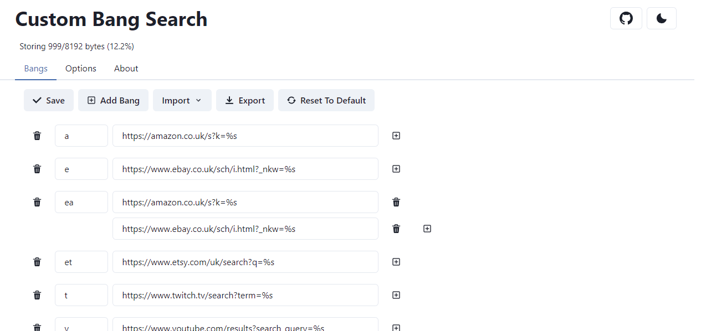

#  Custom Bang Search

[](https://addons.mozilla.org/en-US/firefox/addon/custombangsearch/)
[](https://addons.mozilla.org/en-US/firefox/addon/custombangsearch/)
[](https://addons.mozilla.org/en-US/firefox/addon/custombangsearch/)
[](https://chrome.google.com/webstore/detail/custom-bang-search/oobpkmpnffeacpnfbbepbdlhbfdejhpg?hl=en)
[](https://chrome.google.com/webstore/detail/custom-bang-search/oobpkmpnffeacpnfbbepbdlhbfdejhpg?hl=en)
[](https://chrome.google.com/webstore/detail/custom-bang-search/oobpkmpnffeacpnfbbepbdlhbfdejhpg?hl=en)

[](https://addons.mozilla.org/en-US/firefox/addon/custombangsearch/)
[](https://chrome.google.com/webstore/detail/custom-bang-search/oobpkmpnffeacpnfbbepbdlhbfdejhpg?hl=en)

A browser extension to use custom DuckDuckGo-like bangs directly from the address bar.

## Example Searches

```
!a monitor  ▶ https://www.amazon.co.uk/s?k=monitor
!r G273QF   ▶ https://www.google.com/search?q=site%3Areddit.com+G273QF
!m new york ▶ https://www.google.com/maps/search/new%20york
!y boids    ▶ https://www.youtube.com/results?search_query=boids
```

## Demo Video

[](https://www.youtube.com/watch?v=IXP7RVFMJk4)

## Search Engines

[These search engines are tested and officially supported](./docs/supported-engines.md).

If you set one of these as your browsers search engine, you can use the bangs directly in the search bar.

Bangs will also work by just using the search engines normally.

## Options Page

The bang editing menu and general options are accessed using the extensions options page:



All of your bangs and options are saved to the browsers sync storage, meaning if you log into your browser they will sync across to wherever else you are logged in.

This storage has a strict quota, and you can see the amount of it you are using at the top of the options page.

### Bangs

Go to the options page to start creating custom bangs. This can be accessed through the extensions popup, or through your browsers extensions menu.

Each item in the list shows a bang, and a URL or set of URLs that will be opened when this bang is used.

Pressing the "add bang" button will add a new bang to the bottom of the list, which you can then edit.

The trash buttons on the left remove whole bangs, and the buttons on the right are for URLs.

Use `%s` in the URLs to show where you want your query to be inserted, take a look at the default bangs if you need some help understanding how to format things.

_Some of the default URLs including Amazon, Ebay, and Etsy are UK URLs, so change those if you need to!_

You can also import and export your list of bangs to/from a valid JSON file.

If the save button is highlighted green, this means you have unsaved changes and they will not take effect until you press the save button.

### Options

An options tab exists within the options page, which allows you to change the behaviour of the extension.

Currently this is just the search engines that the extension is enabled to use bangs with.

### DuckDuckGo Bangs

If you want to import bangs from DuckDuckGo, see [this page](./ddg/README.md).

## How the extension works

CBS uses the `WebRequestBlocking` API to intercept requests to the supported search engines, and if a bang is found, redirects the user to the chosen URL with the query inserted.

## Development

### Building

```bash
git clone https://github.com/psidex/CustomBangSearch.git
cd CustomBangSearch
npm install
npm run build-firefox OR build-firefox-release OR build-chrome OR build-chrome-release
```

This produces a `build` directory containing the compiled JavaScript, and if building the release version, 2 zip files in the root of the project that can be uploaded to the browser web extension stores.

Non "release" builds (i.e. dev builds) are not minified, can contain debugging calls such as `console.log`, and also contain some development tools loaded into the popup &| options windows.

### Details

A custom script, `bob.mjs`, is used to build and package the extension. This was created just to speed up the build process and make testing much easier.

esbuild is used to compile the TypeScript to JavaScript, the tsc compiler is listed as a dependency but this is just used for type checking / linting.

The manifest files link to the compiled build made by esbuild, not the TS files, so make sure they are built before you build the extension package.

## Credits

- Icon created by [apien on Flaticon](https://www.flaticon.com/free-icon/exclamation-mark_4194667)
- [DuckDuckGo bangs](https://duckduckgo.com/bang)
- [!Bang Quick Search](https://addons.mozilla.org/en-US/firefox/addon/bang-quick-search/)
