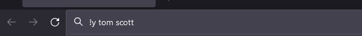
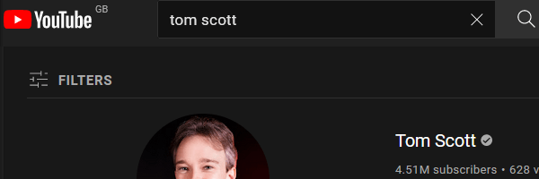

# Custom Bang Search

[](https://addons.mozilla.org/en-US/firefox/addon/custombangsearch/)
[](https://addons.mozilla.org/en-US/firefox/addon/custombangsearch/)
[](https://addons.mozilla.org/en-US/firefox/addon/custombangsearch/)
[](https://chrome.google.com/webstore/detail/custom-bang-search/oobpkmpnffeacpnfbbepbdlhbfdejhpg?hl=en)
[](https://chrome.google.com/webstore/detail/custom-bang-search/oobpkmpnffeacpnfbbepbdlhbfdejhpg?hl=en)
[](https://chrome.google.com/webstore/detail/custom-bang-search/oobpkmpnffeacpnfbbepbdlhbfdejhpg?hl=en)
[](https://www.buymeacoffee.com/psidex)

[](https://addons.mozilla.org/en-US/firefox/addon/custombangsearch/)
[](https://chrome.google.com/webstore/detail/custom-bang-search/oobpkmpnffeacpnfbbepbdlhbfdejhpg?hl=en)

A web extension that allows you to use DuckDuckGo-like custom bangs directly
from the address bar.

This currently only works if you have Google, Bing, DuckDuckGo, or Qwant set as
your browsers search engine.

## Demo





[Demo video](https://youtu.be/q41XyWYLEUM)

## Options page

- Go to the extensions options page to change the bangs and where they go
- Click on any cell in the table to edit it; the bang is what goes after the !
  (e.g. !m) and the url is where it takes you
- Use `%s` in the URL to show where the search query should be inserted
- No changes will be made unless you click the save button, this includes
  importing and resetting to defaults
- Bangs are case-sensitive, so you can have 'm' and 'M'
- **You can open multiple URLs with one bang by using `" :: "` (space, double
  colon, space) to separate them (see `ea` in the default bangs)**

### Defaults

Take a look at the default bangs if you need some help understanding how to
write the URLs.

_The Amazon, Ebay, and Etsy defaults are UK URLs so change those if you need
to!_

## How it works

When you type a query in the search bar, your browser makes a request to your
browsers set search engine. This extension intercepts that request, and if the
query matches a bang (e.g. `!m new york`) it will tell the browser to go the url
set to that bang with the given query, instead of your original search.

This has the side effect of (sometimes) working if you type a bang into the
actual search engine as well.

## Development

### Building

```bash
git clone https://github.com/psidex/CustomBangSearch.git
cd CustomBangSearch
yarn install
yarn buildcode # .ts, tsx -> .js
yarn buildext # creates extension .zip file
# You should now have a directory called "web-ext-artifacts" that contains the built extension
```

### Details

The only things actually required to build this extension from source to
something that is installable in your browser are `react`, `react-dom`,
`nanoid`, `react-hot-toast`, and `esbuild`.

`web-ext` is used to generate the extension package but it _can_ be done by
hand.

Everything in `devDependencies` is purely for linting, and `typescript` and
`webextension-polyfill` are purely used for type checking, they aren't required
by `esbuild`.

`manifest.json` links to the compiled build made by `esbuild.config.js`, not the
TS file. In a similar fashion, `options.html` links to the build not the TSX
files, so make sure they are built before you build the extension package.

## Credit

- [DuckDuckGo bangs](https://duckduckgo.com/bang)
- [!Bang Quick Search](https://addons.mozilla.org/en-US/firefox/addon/bang-quick-search/)
- [Water.css](https://github.com/kognise/water.css)
